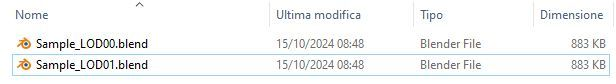

# Add-on parameters

The **LODs Easy Generator** custom Blender add-on allows the selection of the following parameters:

- **Search by**:
  - "Collections" / "Meshes"
- **Search Filter**:
  - "All" / "By Name"
- **Name Filter** -> if "Search by Meshes" the **Name Filter** also accept wildcar
- Number of Iterations:
  - **LODs Start** with a value between 0 and 9
  - **LODs End** with a value between 0 and 9
- **Enable Collections by Iterations** (Y/N)
- **Subdiv Modifiers**:
  - "Leave"
  - "Reduce Level"
  - "Delete"
- **Delete existing Decimate Modifiers** ("None" / "All" / "LODs generated only")
- **Apply all Modifiers** ("Never" / "Start of Iteration" / "End of Iteration" / "Both Start and End of Iteration")
- **Decimate Type** ("Collapse" / "Un-subdivide" / "Planar")
- Decimate Parameters (by **Decimate type**):
  - "Collapse":
    - **Collapse Ratio**
    - **Collapse Triangulate**
  - "Un-Subdivide":
    - **Un-Subdivide Iterations**
  - "Planar":
    - **Planar Angle Limit** 
    - **Delimit** ("None" / "Normal" / "Seam" / "Sharp" / "UVs")
    - **All Boundaries** ("Y" / "N")
- **Apply Incrementally** ("Never", "Once", "From LOD00 onwards", "From LOD01 onwards")
- **Add Weighted Normal Modifier** ("Y" / "N")
- **Directory** (it can be a relative of a full path reference)
- **Filename** used to create the LODs filename (it can be empty, if entered it can include the .blend extension)

# Add-on workflow
The **LODs Easy Generator** add-on implements the following workflow:
1. Retrieve list of Mesh objects in the Blender file being edited matching the selection parameters:
   - If "Collections" and "By Name" have been selected the retrieved meshes are all belonging to the collection identified by its _Name_ property matching the **Name Filter** (no wildcard is allowed)
   - If "Meshes" and "By Name" have been selected the retrieved meshes are all the ones identified by their _Name_ matching the **Name Filter** (also using wildcard)
   - In all other cases just select all meshes

2. For each Iteration between **LOD Start** and **LOD End** (both included)
    - If **Enable Collections by Iterations** is selected then:
      - It makes visible (if hidden) in the viewport all the collections having their _Name_ property containing "LOD0"+Iteration; it also makes visible (if hidden) all belonging meshes regardless of their _Name_ property
        - For example in the iteration "1" it will make visible in the viewport the Collections having "LOD01" in their _Name_ (and all belonging objects regardless of their Name)  
      - It hides from the viewport all the collections having their _Name_ property containing "LOD0"+a different iteration; it also hide all belonging meshes regardless of their _Name_ property
        - For example in the iteration "1" it will hide in the viewport the Collections having "LOD00" or "LOD02" in their _Name_ (and all belonging objects regardless of their _Name_)
      - It goes recursively throught the collection children hierarchy

    - For each previously selected Mesh object, if visible in the viewport:
      - If **Subdiv Modifiers** is not "Leave":
        - if "Reduce" is selected it reduces by one the current _Level_ parameter for each associated Subdiv modifier
        - if "Delete" is selected it deletes all associated Subdiv modifiers

      - If **Delete existing Decimate modifier** is not "None" it deletes all (if "All" has been selected) Decimate modifiers associated to it or just the ones created by the **LODs easy generator**

      - If **Apply all modifiers** is "Start of Iteration" or "Both Start and End of Iteration" it applies all the modifiers associated to it

      - It appends a new Decimate modifier to the selected mesh having:
        - _Name_ set as "LOD0"+"Iteration"
        - _Type_ set as **Decimate type**
        - if **Apply Incrementally** is:
          - "Never" -> Increment is set to 0
          - "Once" -> Increment is set to 1
          - "From LOD00 onwards" -> Increment is set to Iteration+1
          - "From LOD01 onwards" -> Increment is set to Iteration
        - Attibutes set (by **Decimate type**) based on Decimate Parameters and in particular:
           - If "Collapse" the modifier property _Ratio_ is set as 1-**Collapse Ratio***Increment
           - If "Un-Subdivide" the modifier property _Iterations_ is set as **Un-Subdivide Iterations***Increment
           - If "Planar" the modifier property _Angle Limit_ is set as **Planar Angle Limit***Increment

      - If **Add Weighted Normal Modifier** is selected it adds a default WeightedNormal modifier to it with _Keep Sharp_ and _Face Influence_ properties set

      - If **Apply all modifiers** is "End of Iteration" or "Both Start and End of Iteration" it applies all the modifiers associated to it

    - If **Filename** is not empty it saves a new blender file in the selected **Directory** with the name built as **Filename**+"LOD0"+"Iteration"

**Note**: the Blender file created for the last iteration will become the one being currently edited

# Add-on execution
With the parameters shown in the previous picture, the **Generate LOD files** button will create two files as shown in the following pictures:

The first iteration (Sample_LOD00.blend) file will be like this:

The second (and last) iteration (Sample_LOD01.blend) file will be like this (and the one currently being edited at the end of the generation process):

