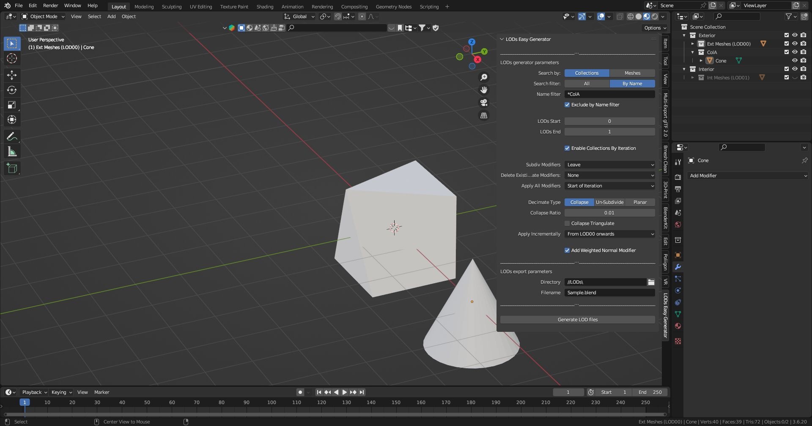

The **LODs Easy Generator** custom Blender add-on allows the selection of the following parameters:

- **Search by:**
  - Collections / Meshes
- **Search Filter:**
  - All / By name
    -  If Search by Meshes the Search Filter also accept wildcard
- Number of Iterations (from **LODs Start** to **LODs End**)
- **Enable Collections by Iterations** (Y/N)
- **Subdiv Modifiers**:
  - Leave
  - Reduce Level
  - Delete
- **Delete existing Decimate Modifiers** (Y/N)
- **Apply all Modifiers** (Y/N)
- **Decimate Type** (Collapse/Un-subdivide/Planar)
- Decimate Parameters (by **Decimate type**)
  - Collapse:
    - Collapse Ratio
    - Collapse Triangulate
  - Un-Subdivide:
  - Planar:
    - Delimit (None/Normal/Seam/Sharp/UVs) //only if Planar
    - Decimate ratio (Numeric)

- LODs path
- LODs filename

It implements the following workflow:

