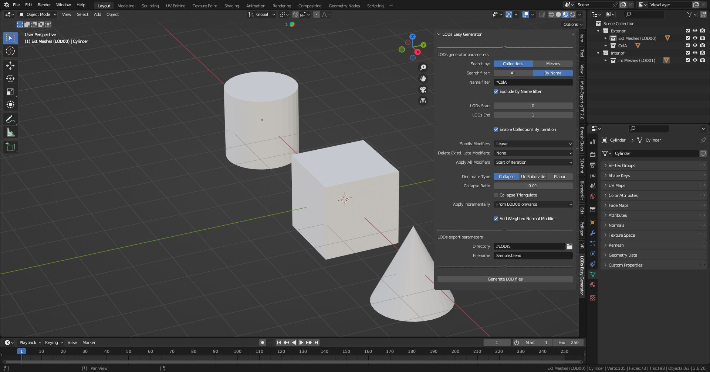

The **LODs Easy Generator** custom Blender add-on allows the selection of the following parameters:

- **Search by**:
  - "Collections" / "Meshes"
- **Search Filter**:
  - "All" / "By Name"
- **Name Filter** -> if "Search by Meshes" the **Name Filter** also accept wildcar
- Number of Iterations (from **LODs Start** to **LODs End**)
- **Enable Collections by Iterations** (Y/N)
- **Subdiv Modifiers**:
  - "Leave"
  - "Reduce Level"
  - "Delete"
- **Delete existing Decimate Modifiers** ("Y" / "N")
- **Apply all Modifiers** ("Y" / "N")
- **Decimate Type** ("Collapse" / "Un-subdivide" / "Planar")
- Decimate Parameters (by **Decimate type**):
  - "Collapse":
    - **Collapse Ratio**
    - **Collapse Triangulate**
  - "Un-Subdivide":
    - **Un-Subdivide Iterations**
  - "Planar":
    - **Planar Angle Limit** 
    - **Delimit** ("None" / "Normal" / "Seam" / "Sharp" / "UVs")
    - **All Boundaries** ("Y" / "N")
- **Directory**
- **Filename**

It implements the following workflow:

With the parameters shown in the previous picture, the Generate LOD files" button will create two files as shown in the following pictures:

